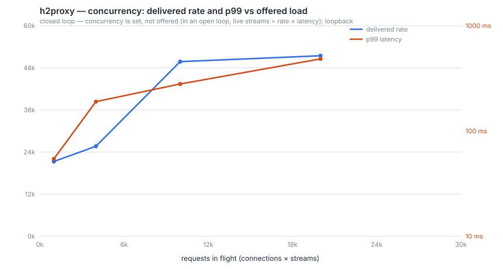

# Results

The measurements behind every performance claim in this repository, and — just
as important — the exact conditions each one was taken under.

> ## What these numbers are, and what they are not
>
> **They are laptop numbers.** Every figure here was produced on one Apple
> Silicon machine (10 cores, 24 GB) over **loopback**, with the load generator,
> the proxy and the backend all competing for the same CPUs. There is no NIC, no
> network RTT, no load balancer, and no other tenant.
>
> **The deployment did not happen.** The AWS stack in [`infra/`](../infra/) is
> written, synthesizes, and is checked by template assertions on every push — and
> it has never been deployed ([ADR 0022](../docs/adr/0022-infrastructure-as-code.md)).
> Nothing here is a Graviton number or an NLB number.
>
> **What that costs, specifically.** Loopback flatters latency (no wire) and
> punishes throughput (the generator steals cores). The knee below is where *this
> machine* stops keeping up, and on a dedicated instance pair it would be
> somewhere else. Absolute figures should be read as "this engine, on one laptop,
> under these exact scripts"; the *relative* figures — before/after a change, one
> allocator against another, corrected against uncorrected — are the ones that
> carry over.
>
> Every table below names the harness that produced it. All of them are in
> [`bench/`](../bench/), and all of them are re-runnable with one command.

## Methodology, in one paragraph

Two profiles, because they fail differently ([bench/README.md](../bench/README.md)).
The **throughput** profile asks how many small requests per second the proxy
serves at an honest tail, and is measured **open-loop**: a fixed request
schedule, no throttling, and latency measured from when each request was
*supposed* to be sent. The **concurrency** profile asks how many simultaneous
streams hold up, and is measured **closed-loop**, because in an open loop live
streams are rate × latency (Little's law) — offering more load raises the rate,
not the concurrency. Concurrency has to be set, not offered. Every run discards a
warm-up window, and the proxy is always built `--release`.

## The correction, stated

`h2load` — which produced every number in this project before week 8 — cannot
measure a tail. Its `--rate` creates *connections* per period rather than
requests, `-D` and `-r` are mutually exclusive, and it keeps *n* requests in
flight per connection, issuing the next when the last completes. That is a
closed loop, and a closed loop cannot queue: a server that stalls for a second
simply receives fewer requests during the stall, so the stall is measured once
instead of in every request a real arrival process would have piled up behind it.

[`loadgen`](../loadgen/) measures both numbers for the same requests, so the
size of the correction is reported rather than asserted. It is small while the
proxy is comfortable and grows into the dominant term as the knee approaches —
which is exactly where a p99 gets quoted.

## Throughput profile — the curve

50 connections, 1 KiB responses, offered rate stepped past saturation. 12 s of
steady state per step after a 3 s warm-up. `just curve` → `bench/curve.csv`.


| Offered req/s | Delivered | p50 ms | p99 ms | p99 uncorrected | Generator lag p99 | Streams live at proxy |
|---:|---:|---:|---:|---:|---:|---:|
| 2,000 | 2,000 | 0.275 | 0.455 | 0.345 | 0.123 | 1 |
| 5,000 | 5,000 | 0.149 | 0.193 | 0.139 | 0.061 | 0 |
| 10,000 | 10,000 | 0.127 | 0.297 | 0.254 | 0.050 | 1 |
| 15,000 | 15,000 | 0.149 | 0.414 | 0.369 | 0.062 | 1 |
| 20,000 | 20,000 | 0.158 | 0.785 | 0.665 | 0.087 | 3 |
| **25,000** | **25,000** | **0.542** | **2.045** | 2.023 | 0.060 | 16 |
| 30,000 | 30,000 | 370.400 | 434.323 | 434.303 | 6.004 | 11,106 |
| 40,000 | 40,000 | 315.359 | 332.656 | 332.624 | 0.114 | 11,190 |
| 50,000 | 50,000 | 256.944 | 278.606 | 278.582 | 0.187 | 11,205 |

**Zero failed requests at every step.** The headline: **25,000 req/s at a
corrected p99 of 2.0 ms**, which is the project's stated sub-3 ms target. One
step further costs a factor of 200 in latency.

### Three things in that table are worth explaining

**Delivered rate never stops tracking offered rate — even at twice the knee.**
The proxy does not shed load past saturation; it *queues*. That is why the knee
above is defined by the latency target rather than by throughput falling off: a
knee read from the throughput column alone would sit at the right-hand edge of a
chart whose entire right half is unusable.

**The streams-live column explains the cliff, and it is the admission limit.**
50 connections × `MAX_CONCURRENT_STREAMS` of 256 = **12,800** admissible streams.
Past the knee the live-stream count pins near that ceiling and stays there. Once
concurrency is capped, Little's law runs backwards — latency becomes
*ceiling ÷ throughput*:

| Offered | Ceiling ÷ rate | Measured p50 |
|---:|---:|---:|
| 30,000 | 12,800 / 30,000 = 427 ms | 370 ms |
| 40,000 | 12,800 / 40,000 = 320 ms | 315 ms |
| 50,000 | 12,800 / 50,000 = 256 ms | 257 ms |

Which is also why p50 *falls* as the offered rate rises above the knee — the
one genuinely counter-intuitive number here, and not noise. Requests wait for a
stream slot, and more offered load does not make the wait longer; it makes each
slot turn over faster.

**The correction is small in this setup, and saying so is the point.** Between
0.02 and 0.13 ms below the knee. That is the generator's own queueing, which a
closed-loop tool would have silently subtracted. The larger effect of a closed
loop is not visible as a delta at all: a closed loop cannot offer 30,000 req/s
to a proxy that is only comfortable at 25,000, so it would never have produced
the bottom three rows — the ones that show what saturation actually costs.

## Concurrency profile

500 connections, closed loop (concurrency is set, not offered — in an open loop
live streams are rate × latency, so offering more load raises the rate, not the
concurrency). `streams live` is read from the proxy's **own** gauge, not the
client's intent.



| Requests in flight | Delivered req/s | p50 ms | p99 ms | Streams live at proxy |
|---:|---:|---:|---:|---:|
| 1,000 | 23,959 | 41.6 | 45.1 | 503 |
| 4,000 | 30,625 | 140.8 | 147.7 | 1,526 |
| 10,000 | 52,940 | 184.1 | 218.6 | **8,119** |
| 20,000 | 53,600 | 377.4 | 411.6 | **17,872** |

**17,872 streams open simultaneously**, at 53,600 req/s, with zero failures —
which is what backs the "10,000+ concurrent streams" claim, measured at the
proxy rather than asserted by the client. Delivered rate flattens at ~53k
between the last two rows while concurrency doubles: past that point more
in-flight requests buy queue depth, not throughput.

## Tuning pass 1 — flow-control windows

The windows were *reasoned* from week 5 to week 8: 256 KiB per stream, a 1 MiB
connection window, derived from the RFC and from arithmetic. `just tune` sweeps
them. 20,000 req/s of small requests, plus a bulk transfer and a deliberately
slow reader at each point.

| Conn window | Stream window | Bulk MiB/s | Bridge peak | Stalls |
|---:|---:|---:|---:|---:|
| 256 KiB | 64 KiB | 244.8 | 66 KB | 0 |
| 256 KiB | 256 KiB | 272.6 | 243 KB | 0 |
| **1 MiB** | 64 KiB | 216.0 | 66 KB | 0 |
| **1 MiB** | **256 KiB** ← default | **274.0** | **262 KB** | 0 |
| 1 MiB | 1 MiB | 294.2 | 328 KB | 0 |
| 4 MiB | 64 KiB | 232.7 | 67 KB | 0 |
| 4 MiB | 256 KiB | 282.5 | 263 KB | 0 |
| 4 MiB | 1 MiB | 281.9 | 951 KB | 0 |
| 16 MiB | 64 KiB | 214.3 | 68 KB | **158** |
| 16 MiB | 256 KiB | 246.6 | 262 KB | 0 |
| 16 MiB | 1 MiB | 278.7 | 902 KB | 0 |

**Outcome: the defaults are kept, and now they are measured rather than
reasoned.** 1 MiB / 256 KiB delivers 274 MiB/s — within 7% of the best point in
the sweep — while holding 262 KB in the bridge, roughly a quarter of what the
fastest settings hold. Raising the stream window to 1 MiB buys about 5% more
bulk throughput for 3.5× the memory the bridge may hold for a stalled client. On
a proxy whose headline property is bounded memory, that is the wrong side of the
trade.

Three things this sweep taught that the numbers alone do not show:

**The small-request columns are blind to flow control by construction**, and the
first version of this sweep did not notice. A 1 KiB response cannot fill even a
64 KiB window, so request rate and its latency are identical at every setting —
the whole point of a window is how many octets may be in flight before the
sender must stop, which only bites on transfers larger than the window. The
`bulk_mbps` column exists because the first run produced eleven identical rows
and a shrug.

**The bridge peak tracks the *stream* window, not the connection window**, in
this harness — because the slow reader is a single stream, and a single stream is
bounded by its own window first. The connection window is the bound that matters
when *many* streams are slow at once, which is what
`core/tests/backpressure.rs` asserts directly rather than by benchmark.

**The one row with nonzero stalls is the mechanism showing itself.** 16 MiB
connection window with a 64 KiB stream window produced 158 flow-control stalls,
the only nonzero count in the sweep: a connection window so large it never binds,
against stream windows small enough that they always do, leaves the outbound
scheduler holding octets it has no per-stream credit to send. That is exactly
what a stall is, and it appears precisely where the arithmetic says it should.

The p99 column of that sweep is omitted here on purpose: it ranged from 0.49 ms
to 148 ms across settings that differ by nothing relevant, which is machine
noise, and quoting it would be dressing up a coin toss.

## Tuning pass 2 — the allocator (ADR 0010)

Deferred since July with the instruction "report the number, don't assume the
win". The number is in
[ADR 0010](../docs/adr/0010-jemalloc-allocator.md#the-measurement-2026-08-09--and-the-verdict);
the summary is that **jemalloc is not enabled**.

| | system (musl) | jemalloc |
|---|---|---|
| Throughput | 20,000 req/s | 20,000 req/s (+0.0%) |
| p99, median of 6 | 37.1 ms | 28.4 ms (−23.5%) |
| p99, **range** | **2.8 – 122.2 ms** | **5.5 – 88.0 ms** |
| RSS, range | **3.6 – 5.6 MiB** | **64.9 – 73.3 MiB** |

Six interleaved pairs in the musl container. The p99 ranges overlap almost
entirely, so the 23% median difference is not an effect — it is two noisy samples
landing where they landed. The RSS difference does not overlap at all: a
consistent **13×**, from jemalloc's per-CPU arenas, on a process whose working
set is otherwise under 6 MiB. The feature stays in the tree behind
`--features jemalloc`, switched off, because the question deserves re-asking on
hardware that can put the allocator under real pressure.

Getting the arm to build at all required three toolchain fixes, none of which
could have been found by reading the Dockerfile — including aarch64 GCC's default
`-moutline-atomics`, which links a libgcc object calling the glibc-only
`__getauxval` and makes jemalloc's configure conclude the platform has no
atomics. The ADR's claim of "no new build-image cost" was simply wrong.

## Resilience (week 7 harnesses, unchanged)

| Claim | Number | Harness |
|---|---|---|
| Backend killed mid-load, 200k requests | **0 5xx**, 2 ejections, 247 retries rescued | `just attack` |
| Backend that accepts and then answers nothing | detected and ejected in ~2× `ping_idle`; requests get an answer instead of hanging | `core/tests/probe.rs` |
| 5-minute soak, backend killed and restarted every 30 s | 13.0M requests, **0 5xx**, 1,177 retries, 16 ejections, 126 probes / 0 probe failures; RSS plateaued, every in-flight gauge settled to **0** | `just soak` |
| SIGTERM mid-load, 75k requests | **0 5xx**; a 20 MB response completed in full across it | `just attack` |
| Rapid Reset flood beside ordinary load | attacker GOAWAYed; bystander p99 **11.65 → 8.11 ms** (unharmed) | `just attack` |
| Abuse-guard cost per frame | **0.46%** of frame dispatch (272.1 → 273.4 ns) | `just bench-hot` |
| Threshold headroom vs. legitimate traffic | **12.5×–20×**, measured | `just calibrate` |
| Accounting invariants, 3,000 requests over every ending | 0 leases outstanding, 0 streams, 0 buffered, `latency_count == 3000` | `core/tests/invariants.rs` |

## Conformance and correctness

| Check | Result |
|---|---|
| h2spec (RFC 9113), engine only | **146/146** |
| h2spec, through the proxy to a real backend | **146/146** |
| Test suite, debug | 258 passing |
| Test suite, release | 258 passing |
| Fuzz targets (frame parser, HPACK decoder, guard) | build clean; 8.5M+ executions clean |
| Abuse guard during conformance | `h2proxy_connections_terminated_total` = 0 — no false positive on legitimate traffic |

## Reproducing all of it

```sh
just curve        # the two profiles above; promotes bench/curve.csv and curve.svg
just tune         # the flow-control sweep
just allocator    # the ADR 0010 A/B (needs Docker)
just calibrate    # abuse thresholds vs legitimate traffic
just attack       # Rapid Reset + backend kill, each with a control
just soak         # five minutes, backend dying throughout
just bench-hot    # criterion micro-benchmarks
just synth        # the CDK stack's template assertions
```
