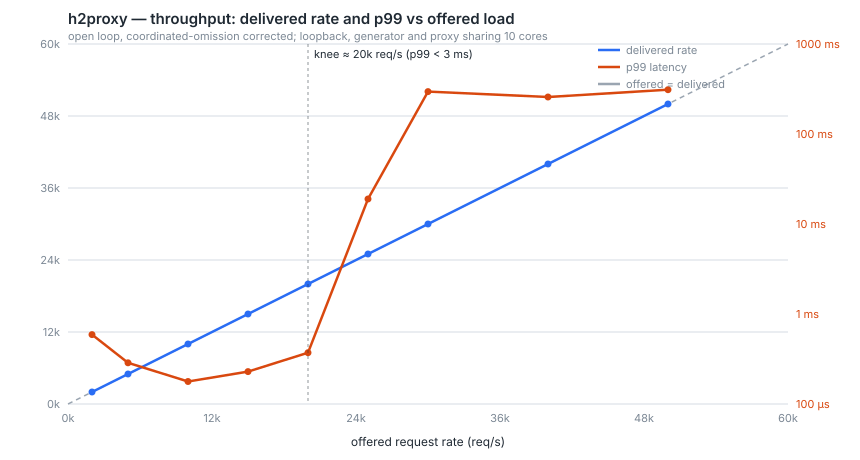

# h2proxy — an HTTP/2 multiplexing reverse proxy, from scratch in Rust

A reverse proxy that speaks HTTP/2 on **both** sides — terminating TLS,
negotiating `h2` via ALPN, multiplexing thousands of client streams, and
coalescing them onto a handful of warm upstream connections. The HTTP/2
protocol engine is hand-built against the wire format; the point of the
project is the parts of HTTP/2 that are easy to gloss over and hard to get
right.

## What it does

A client opens one TLS connection and multiplexes many concurrent requests
over it. h2proxy terminates that connection, decodes the HTTP/2 framing and
compressed headers itself, and forwards each request onto a small pool of
long-lived upstream connections — many streams in, few connections out.

```
                   ┌──────────────── h2proxy ────────────────┐
  clients          │                                          │      upstreams
  ───────          │  TLS 1.3 ─ ALPN h2                        │      ─────────
  ~500 conns ─────▶│  frame codec ─ HPACK ─ stream machine     │──┐
  10k+ streams     │  flow control ─ backpressure bridge       │  ├─▶ few warm
                   │  connection pool ─ load balancer          │──┘   h2 conns
                   └──────────────────────────────────────────┘
```

The parts that carry the weight:

- **Framing** — a streaming codec over a reassembly buffer that advances only
  on a complete frame, so a frame split across TCP segments is never
  mis-parsed. All eight frame types the proxy uses, with their length,
  stream-id and flag rules, and each violation mapped to the error code the
  RFC mandates.
- **HPACK** — the stateful one. Integer and string primitives, the Huffman
  code as a derived state machine, the 61-entry static table, and the dynamic
  table with its eviction accounting. Encoder and decoder tables must stay in
  lockstep across a whole connection: a single desync corrupts every later
  header block.
- **Streams and flow control** — the lifecycle state machine, fair outbound
  interleaving so one large response cannot starve small ones, and two-level
  (connection + stream) windows.
- **Backpressure bridging** — the centerpiece. The proxy withholds the
  upstream's `WINDOW_UPDATE` until bytes have drained to the client, so a slow
  client transitively throttles a fast upstream and proxy memory stays bounded
  under any speed mismatch. Nothing is buffered and nothing blocks: credit is
  relayed, so the bound is the *window* (1 MiB) rather than the response size.
- **Coalescing** — a shared pool behind every client connection. Twenty client
  connections carrying 400 streams land on a handful of upstream connections,
  and the stream-id remapping between the two id spaces is the pool's job.
- **Resilience** — connection pooling and coalescing, load balancing by
  least-outstanding-streams, health checking with outlier ejection, active PING
  probing and single-request probe-back, conservative idempotent-only retries,
  and a graceful two-phase GOAWAY drain on both legs. The probe is the part that
  catches a backend which accepts connections and then answers nothing: it fails
  no request, it *hangs* them, so nothing passive can see it.
- **Defence** — per-connection accounting for the HTTP/2 abuse patterns: Rapid
  Reset (CVE-2023-44487), PING and SETTINGS floods, empty-DATA floods, and
  CONTINUATION floods. The offending connection is closed with
  `ENHANCE_YOUR_CALM`; everyone else is untouched. The thresholds are
  **measured**, not guessed — see below.

Errors follow HTTP/2's own split: a connection error emits GOAWAY and takes
the connection down; a stream error emits RST_STREAM and leaves it up.

## Why build it from scratch

Modern services live or die on how well they multiplex work over a few
expensive resources: TCP connections, TLS sessions, file descriptors. HTTP/1.1
forces one in-flight request per connection; HTTP/2 carries many interleaved
streams over one long-lived connection. A proxy that speaks h2 on both sides
takes thousands of client streams arriving over a few hundred connections and
fans them onto a few warm upstream connections. That collapse — fewer
connections doing more work — is the source of the latency and throughput wins
this project targets.

## Scope of "from scratch" (the honest version)

**Hand-built** (this is the learning goal): the frame codec, the complete HPACK
encoder/decoder (static + dynamic tables, Huffman, integer/string primitives),
the stream state machine, connection and stream flow control, and the
connection-management logic that bridges the client and upstream sides.

**Reused, deliberately:** the async runtime (**tokio**) and the TLS 1.3 stack
(**rustls**). Reimplementing an async scheduler or a TLS record layer would be a
different project and a security liability.

**Used for tests only:** the mature [`h2`](https://github.com/hyperium/h2) crate,
as a **differential-testing oracle** — the hand-written codec is fuzzed and
round-tripped against it so that "from scratch" never means "subtly wrong on
the wire."

The reasoning behind each of these — and tokio-vs-glommio, NLB-vs-ALB,
aarch64-musl, the error model, and more — is recorded as
[Architecture Decision Records](docs/adr/). Condensed notes on the relevant
RFCs (9113, 7541, 9218) and the Rapid Reset CVE are in [docs/notes/](docs/notes/).

## How it is tested

Correctness here is not self-reported. The engine is checked in layers:

- **Unit tests** for each frame type's size, stream-id, flag and padding rules.
- **Differential tests** against the `h2` crate: a real `h2` client runs a full
  session against our engine, and every frame it puts on the wire is decoded
  and re-encoded to **byte-identical** octets.
- **RFC vectors** — HPACK's Appendix C sequences pass byte-for-byte in both
  directions, including the dynamic-table evictions they were designed to
  provoke.
- **Property tests** — encode/decode identity, in-order decoding of a frame
  stream, byte-at-a-time reads never mis-parsing, and encoder/decoder tables
  staying in lockstep over arbitrary header sequences.
- **Property tests over flow control** — that a window never wraps or exceeds
  2³¹−1, that a closed stream leaves no entry behind, and the one that matters:
  we never emit more octets than the peer credited, at either level.
- **Fuzzing** — `cargo-fuzz` targets for the frame parser and the HPACK
  decoder, both fed wholly unconstrained input. The contract is total: any
  input yields `Err`, `Ok(None)` or a frame — never a panic.
- **Differential tests in both roles** — the `h2` crate is the oracle on each
  side: a real `h2` client runs against our server engine, and a real
  `h2::server` runs against our hand-built *client* engine. A session only
  progresses if the frames we synthesize are ones a mature implementation
  accepts.
- **A bounded-memory test** — a backend producing 64 MiB against a client
  reading a few KB at a time, asserting that the octets held between them stay
  under one connection window *and* that the backend provably stopped. Both
  halves matter: flat memory alone would also describe a proxy that dropped data.
- **Accounting invariants at scale** — 3,000 requests through every ending a
  stream has (served, refused-and-retried, failed, cancelled mid-download, and a
  backend killed under live traffic), then the assertion that the books balance:
  zero pool leases outstanding, zero streams open, zero octets in the bridge.
  These are the bugs that no single request exposes — the worst two of the last
  fortnight were both invisible below a few thousand requests.
- **A soak** (`just soak`) — five minutes of load with a backend killed and
  restarted every 30 s, sampling the quantities that must stay *flat* rather than
  the ones that must be fast. It found a real leak on its first run: the
  active-stream gauge counted every stream of every client that hung up
  mid-request, forever. Nothing broke and nothing leaked but the numbers, which
  is exactly why a week of feature tests missed it.
- **Conformance** — [h2spec](https://github.com/summerwind/h2spec)'s RFC 9113
  suite runs against the live daemon: **146/146, with and without the proxy path
  in front of a real backend**. It earned its place by finding six real defects
  the suites above did not, including a duplicate END_STREAM that every
  well-behaved client hides, and a second field section being read as trailers
  before the state machine was asked whether the peer could still send.

All of it runs in CI on every push, and the gates are chosen from what has
actually gone wrong here: **the suite in release as well as debug**, because the
worst bug of week 7 was one `--release` compiles away and six weeks of green
debug-only runs never saw; **h2spec in both modes**, with an assertion that the
abuse guard terminated nothing, because a false positive on legitimate traffic is
the way a mitigation becomes an outage; and **a build of every fuzz target**,
because a target that silently stops compiling means nobody has fuzzed that
surface since.

## Goals and non-goals

- **Goal** — a correct HTTP/2 intermediary that negotiates `h2` over TLS via
  ALPN, multiplexes streams, honors flow control in both directions, and keeps
  **bounded memory** under any speed mismatch between client and upstream.
- **Goal** — 10,000+ concurrent streams and ~85k req/s on small responses with
  sub-3 ms p99 (two figures from two test profiles; see the design doc §10).
- **Goal** — reproducible infrastructure as code (AWS CDK) and a load-test
  harness that reports tail latency honestly. The harness is
  [`loadgen`](loadgen/), written for this project because `h2load` is a closed
  loop and structurally cannot measure a tail.
- **Non-goal** — server push (`ENABLE_PUSH = 0`), a dynamic control plane, or an
  HTTP/1.1 downgrade path in v1.

## Workspace layout

```
core/        h2proxy-core — the hand-built protocol engine (library)
  frame  hpack  stream  flow          the protocol primitives
  conn  upstream                      the two connection engines: server, client
  service  proxy  pool  lb            what answers a stream, and where it goes
h2proxyd/    the reverse-proxy daemon (binary): TLS, sockets, config, signals
backend/     a tiny hyper h2c upstream, for the local dev loop and baselines
bench/       load-test harness (h2load) and the committed reference baseline
loadgen/     fixed-rate, coordinated-omission-correct HTTP/2 load generator
infra/       the AWS CDK stack — synth-validated, never deployed
docs/notes/  condensed RFC 9113 / 7541 / 9218 + Rapid Reset notes
docs/adr/    architecture decision records
```

The library/binary split is what lets the differential tests target the engine
directly, without a socket in the way.

## Quickstart

Requires the pinned toolchain (installed automatically from
[`rust-toolchain.toml`](rust-toolchain.toml)).

```sh
# Build and test the workspace
cargo nextest run --workspace      # or: cargo test --workspace

# Run the daemon (defaults to 127.0.0.1:8443; override with H2PROXYD_LISTEN)
cargo run -p h2proxyd

# Prometheus metrics
curl -s http://127.0.0.1:9090/metrics | grep h2proxy_
```

Measuring it, live:

```sh
just curve       # the latency-vs-offered-load curve, corrected for coordinated omission
just tune        # sweep the flow-control windows: bulk throughput against memory held
just calibrate   # measure the abuse thresholds against legitimate traffic
just attack      # Rapid Reset + backend-kill, with a control run to compare
just soak        # five minutes with a backend dying and returning throughout
```

Dev loop (needs [`just`](https://github.com/casey/just)): `just dev` runs a local
h2c backend *and* the proxy wired to it — the full client → proxy → backend path.
`just run-server` runs the engine with no backends, answering from its built-in
responder. `just baseline` captures the no-proxy baseline (see
[bench/README.md](bench/README.md)). Fuzzing: `just fuzz 60 frame_parser` or
`just fuzz 60 hpack_decoder`. Conformance: `just h2spec` (server) or
`just h2spec-proxy` (through the proxy); needs `brew install h2spec`. Leak
hunting: `just soak` (five minutes of load with a backend dying and returning
throughout, failing if anything that should be flat grew).

Proxy a request to a real backend:

```sh
just dev    # backend on :8080, proxy on :8443 forwarding to it

curl -k --http2 https://127.0.0.1:8443/bytes/100000 -o /dev/null \
  -w '%{http_version} %{http_code} %{size_download}\n'
#   → 2 200 100000        ← served by the backend, through the proxy
```

Many streams, and the coalescing evidence:

```sh
h2load -n 20000 -c 50 -m 20 https://127.0.0.1:8443/
#   → 20000 succeeded, 0 failed

curl -s http://127.0.0.1:9090/metrics | grep -E 'upstream_|bridge_'
#   → h2proxy_upstream_pool_connections 8        ← 50 client connections in
#   → h2proxy_upstream_streams_active 0
#   → h2proxy_bridge_buffered_bytes_peak 3072    ← the bridge is holding ~nothing
```

The bounded-memory claim, watched live: run a slow client against a large
response and `h2proxy_bridge_buffered_bytes` stays flat near one connection
window while the transfer runs, instead of tracking the response size.

## Current state

**It is a proxy, and it survives things.** Both halves of the engine are
hand-built and tested: the server side that faces clients, and the client side
that faces backends. A request arrives over TLS, is decoded and validated,
forwarded over a pooled h2c connection to a backend, and the response is streamed
back — with the two connections' flow-control windows coupled so that neither
peer can outrun the other into this process's memory.

Covered by tests: TLS 1.3 + ALPN, the full frame codec, HPACK in both directions
with independent dynamic tables, the stream lifecycle, two-level flow control
with fair interleaving, the upstream pool with coalescing and stream-id
remapping, least-outstanding-streams load balancing, trailers across both legs,
the backpressure bridge, the graceful drain, health checking with ejection,
active PING probing and probe-back, idempotent retries, `x-forwarded-for`, and
the abuse guard.

### The curve



Offered load stepped past saturation, measured **open-loop** with a
coordinated-omission correction — see
[Documentation/RESULTS.md](Documentation/RESULTS.md) for the full tables and the
caveats, of which the first is that these are **loopback numbers on a ten-core
laptop where the load generator competes with the proxy for CPU**.

| | Number |
|---|---|
| Sustained throughput, closed loop | **≥210,000 req/s** (still climbing when the run stopped) |
| Failed requests, every step measured | **0** |
| Concurrent streams held open, measured at the proxy | **17,872** |
| Engine + client leg alone (echo mode, open loop) | 40,000 req/s at **p99 0.216 ms** |

**A correction worth reading before any of these.** An earlier version of this
section reported a "knee at 25,000 req/s" and blamed the proxy's admission limit.
That was the *load generator's* limit: held at the same concurrency, the closed
loop drove the same proxy to 169,000 req/s. The generator has since been fixed —
its open loop spawned a task per request and now uses a worker pool — but a cliff
between 25k and 30k *through a backend* is still unexplained, and it is not the
generator, not CPU, not the pool cap, and not the client leg. Until it is
understood, the closed-loop figure is the honest one.
[Documentation/RESULTS.md](Documentation/RESULTS.md) carries the full correction
and the discriminating experiment.

### Resilience, measured

| Claim | Number |
|---|---|
| Backend killed mid-load, 200k requests | **0 5xx**, 2 ejections, 247 retries rescued |
| Backend that accepts and then answers nothing | detected and ejected in ~2× `ping_idle`; the request gets an answer instead of hanging |
| 5-minute soak, a backend killed and restarted every 30 s | 13.0M requests, **0 5xx**, 1,177 retries, 16 ejections, 126 probes / 0 probe failures; RSS plateaued and every in-flight gauge settled to **0** |
| SIGTERM mid-load, 75k requests | **0 5xx**; a 20 MB response completed in full across it |
| Rapid Reset flood beside ordinary load | attacker GOAWAYed; bystander p99 **11.65 ms → 8.11 ms** (unharmed) |
| Abuse guard cost per frame | **0.46%** of frame dispatch (272.1 ns → 273.4 ns) |
| Threshold headroom vs. legitimate traffic | 12.5x–20x, measured |
| Throughput, before vs. after all of week 7 | 82,985 → 86,711 req/s — **no measurable cost** |
| Flow-control windows, swept | defaults kept: 96% of the best bulk throughput at ~28% of the memory |
| jemalloc vs musl's allocator | **not adopted** — latency difference inside the noise, RSS **13× higher** |

The last row is the one that took discipline: the through-proxy baseline was
captured *before* any week-7 code landed, because once the guard is in the frame
path the pre-hardening number is gone. Capturing it is also what found a
release-only flow-control bug that six weeks of green tests had missed — the
whole suite ran in debug, and `RecvWindow::release` credited its window back
inside a `debug_assert!`, which `--release` compiles away entirely.

Every bug worth remembering here was found the same way: a feature that ran,
passed its tests, and reported nothing. None was found by reading code or adding
a unit test; all were found by measuring — which is why the harnesses are part of
the project rather than notes in a terminal. The full list, and what the five of
them have in common, is in [the retrospective](docs/retrospective.md).

### What is deliberately not claimed

**The deployment did not happen.** The AWS stack in [`infra/`](infra/) — NLB
passing TCP through to a Graviton ASG, backends behind an internal NLB, a same-AZ
load generator — is written, synthesizes with no AWS account, and is checked by
template assertions on every push. **It has never been deployed**
([ADR 0022](docs/adr/0022-infrastructure-as-code.md)). What that costs is
specific: no instance-level numbers, no view of the local-vs-deployed gap, and no
first sight of real traffic shape to re-calibrate the abuse guard against — which
is why every threshold is an environment variable and the container ships with
the guard in observe-only mode.

**Every performance figure here is loopback on a ten-core laptop** where the load
generator competes with the proxy for CPU. The absolute numbers belong to this
machine; the relative ones — before and after a change, one allocator against
another, corrected against uncorrected — are the ones that travel.
[Documentation/RESULTS.md](Documentation/RESULTS.md) labels every row with the
environment that produced it.

The container itself is real, at least: the `scratch` image is **3.19 MB**, built
for `linux/arm64`, and it proxies HTTP/2 end to end between two containers. The
`Dockerfile` had been written and cited by an ADR for five weeks without ever
being executed, and was wrong in three independent ways when it finally was.

## License

MIT — see [LICENSE](LICENSE).
